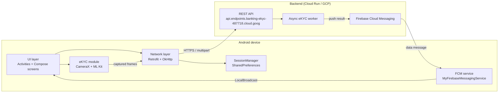
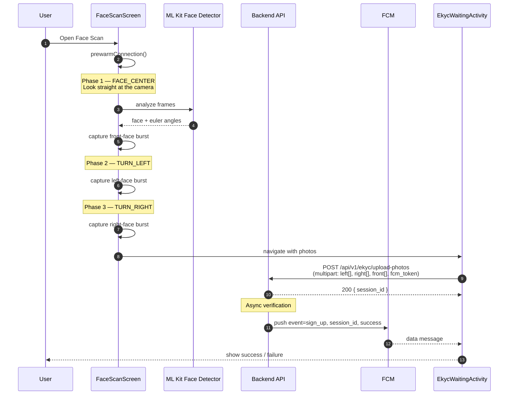

# Banking EKYC

> A native Android banking app demo with biometric **electronic Know-Your-Customer (eKYC)** — sign up and sign in with your face. Built with Kotlin, Jetpack Compose, CameraX, ML Kit Face Detection, Firebase Cloud Messaging, and Retrofit.

[](https://kotlinlang.org/)
[](https://developer.android.com/)
[](https://developer.android.com/jetpack/compose)
[](https://developer.android.com/camerax)
[](https://developers.google.com/ml-kit/vision/face-detection)
[](https://firebase.google.com/docs/cloud-messaging)
[](https://square.github.io/retrofit/)
[](#)

---

## Table of contents

- [Banking EKYC](#banking-ekyc)
  - [Table of contents](#table-of-contents)
  - [Overview](#overview)
  - [Features](#features)
  - [Architecture](#architecture)
  - [eKYC flow walkthrough](#ekyc-flow-walkthrough)
  - [Backend API](#backend-api)
  - [Setup \& build](#setup--build)
    - [Prerequisites](#prerequisites)
    - [Clone \& open](#clone--open)
    - [Run](#run)
    - [Backend](#backend)
  - [Firebase / FCM setup](#firebase--fcm-setup)
  - [Project structure](#project-structure)
  - [Permissions](#permissions)

---

## Overview

**Banking EKYC** is an Android client that demonstrates a production-style customer onboarding flow used by neobanks. New customers register with their email, are guided through a three-step face-capture sequence (center, turn left, turn right) using the front camera, and the captured frames are uploaded to a verification backend. Verification runs asynchronously on the server, and the result is pushed back to the device through a Firebase Cloud Messaging notification — no client-side polling.

Returning customers can also **sign in with their face**: provide an email, scan the front face, and the same async verification mechanism authenticates the session.

The project pairs the modern declarative UI (Jetpack Compose) used for the camera/eKYC screens with the classic View + ViewBinding system used for the banking dashboard, transactions list, and transfer flow — a realistic mix found in many enterprise Android codebases.

## Features

- **Email + password registration and login** with JWT bearer tokens and persistent sessions via `SessionManager`.
- **eKYC sign-up flow**: liveness-style multi-pose face capture (center → left → right) with on-device ML Kit face detection, head-pose validation, and burst frame capture per pose.
- **eKYC sign-in flow**: email + front-face scan re-authenticates the user.
- **Real-time face overlays**: ML Kit landmarks/contours rendered on top of the camera preview (`FaceDetectionOverlay`, `FaceMeshOverlay`, `FaceTrackingOverlay`).
- **Async result delivery**: the device uploads photos and waits on a `WaitingActivity`; the verification result arrives as an FCM data message and is dispatched to the UI through `LocalBroadcastManager`.
- **Connection pre-warming**: the Retrofit client opens a TLS connection to the backend the moment the user enters the face-scan screen, shaving 300–1000 ms off the upload that follows.
- **Banking dashboard**: balance card, friends/contacts list, transactions list (RecyclerView adapters), and chart visualizations using MPAndroidChart.
- **Hybrid UI**: Jetpack Compose for camera/face screens, View + ViewBinding for the rest.

## Architecture



**Layered responsibilities**

- `activities/` — screen controllers (Splash, SignIn, SignUp, FaceScan, EkycWaiting, EkycLoginEmail, EkycLoginFaceScan, BankingMain, Overview).
- `ekyc/` — Compose camera screen, ML Kit analyzer, on-canvas overlays, head-pose validation logic.
- `network/` — Retrofit service, request/response models, OkHttp tuning, JWT session storage.
- `service/` — Firebase Cloud Messaging service that translates push payloads into local broadcasts.
- `adapter/` — RecyclerView adapters for the banking dashboard.
- `domain/` — UI-facing data models.
- `ui/theme/` — Compose theming.

## eKYC flow walkthrough

The eKYC capture is implemented in `FaceScanScreen.kt` and goes through three `ScanPhase` states. Each phase uses ML Kit head-pose angles (`headEulerAngleY`) to validate the user is correctly facing the requested direction, then captures a burst of frames.



**Key files**

- `ekyc/FaceScanScreen.kt` — phase machine + UI prompts (*"Turn your head left"*, *"Turn your head right"*, etc.).
- `ekyc/FaceDetectionAnalyzer.kt` — ML Kit `FaceDetector` with `PERFORMANCE_MODE_ACCURATE`, contours and classification enabled.
- `ekyc/FaceValidation.kt` — validates head pose for each phase and accepts/rejects frames.
- `ekyc/FaceDetectionOverlay.kt`, `FaceMeshOverlay.kt`, `FaceTrackingOverlay.kt` — render landmarks, contours, and tracking boxes on top of the preview.
- `activities/EkycWaitingActivity.kt` — uploads the captured frames and waits for the FCM result.

## Backend API

Base URL: `https://api.endpoints.banking-ekyc-487718.cloud.goog/`

All responses are wrapped in the envelope:

```json
{ "success": true, "code": 200, "message": "OK", "data": { ... } }
```

| Method | Path | Auth | Purpose |
| :--- | :--- | :--- | :--- |
| `POST` | `/api/v1/user/register` | – | Email + password + name + phone → returns JWT access token. |
| `POST` | `/api/v1/user/login` | – | Email + password login → returns JWT access token. |
| `POST` | `/api/v1/ekyc/upload-photos` | Bearer JWT | Multipart upload of `leftFaces[]`, `rightFaces[]`, `frontFaces[]`, plus `fcm_token`. Returns a `session_id`; final result is delivered via FCM. |
| `POST` | `/api/v1/ekyc/login` | – | Multipart eKYC login: `email`, `fcm_token`, `faces[]`. Returns a `session_id`; result is delivered via FCM. |

FCM data payload delivered to `MyFirebaseMessagingService`:

```json
{
  "event": "sign_up | sign_in",
  "session_id": "…",
  "user_id": "…",
  "success": "true | false"
}
```

See `network/AuthApiService.kt` and `network/AuthModels.kt` for the exact contracts.

## Setup &amp; build

### Prerequisites

- Android Studio **Ladybug** (or newer) with the Android Gradle Plugin matching this project.
- **JDK 11** (matches `compileOptions` in `app/build.gradle.kts`).
- Android device or emulator running **API 36** (Android 16). The app sets both `minSdk` and `targetSdk` to 36 — older devices are not supported.
- A device with a **front-facing camera** (an emulator with virtual scene + webcam works).
- A Firebase project — see [Firebase / FCM setup](#firebase--fcm-setup) below.

### Clone &amp; open

```bash
git clone <your-fork-url> banking_ekyc
cd banking_ekyc
```

Open the folder in Android Studio and let Gradle sync.

### Run

```bash
# from the project root
./gradlew :app:installDebug      # build + install on the connected device
adb shell am start -n com.linh.banking_ekyc/.activities.SplashActivity
```

Or just hit **Run ▶** in Android Studio with the `app` configuration selected.

### Backend

The app points at the production-style endpoint defined in `network/RetrofitClient.kt`:

```kotlin
private const val BASE_URL = "https://api.endpoints.banking-ekyc-487718.cloud.goog/"
```

If you run your own backend, change `BASE_URL` (or refactor it into `local.properties` / a build config field) before building.

## Firebase / FCM setup

The async eKYC result delivery requires Firebase Cloud Messaging. `google-services.json` is **gitignored on purpose** — you must provide your own.

1. Create a Firebase project at <https://console.firebase.google.com/>.
2. Add an **Android app** with package name `com.linh.banking_ekyc`.
3. Download `google-services.json` and place it at `app/google-services.json`.
4. In the Firebase console, enable **Cloud Messaging**.
5. (Optional, for local testing) Send a test data message:

   ```bash
   curl -X POST https://fcm.googleapis.com/fcm/send \
     -H "Authorization: key=$SERVER_KEY" \
     -H "Content-Type: application/json" \
     -d '{
       "to": "<device-fcm-token>",
       "data": {
         "event": "sign_up",
         "session_id": "test-123",
         "user_id": "u-1",
         "success": "true"
       }
     }'
   ```

The token is logged on first run with the tag `FCM` — grep `logcat` for `===== FCM Registration Token =====`.

> **Backend integration:** the device passes its FCM token to the server in the `fcm_token` multipart field of the upload/login requests. Your backend uses that token to deliver the verification result.

## Project structure

```
banking_ekyc/
├── app/
│   ├── build.gradle.kts
│   ├── proguard-rules.pro
│   └── src/
│       ├── main/
│       │   ├── AndroidManifest.xml
│       │   ├── java/com/linh/banking_ekyc/
│       │   │   ├── activities/
│       │   │   │   ├── SplashActivity.kt
│       │   │   │   ├── SignInActivity.kt
│       │   │   │   ├── SignUpActivity.kt
│       │   │   │   ├── FaceScanActivity.kt              # eKYC capture (sign-up)
│       │   │   │   ├── EkycWaitingActivity.kt           # uploads + waits for FCM
│       │   │   │   ├── EkycLoginEmailActivity.kt        # eKYC sign-in step 1
│       │   │   │   ├── EkycLoginFaceScanActivity.kt     # eKYC sign-in step 2
│       │   │   │   ├── BankingMainActivity.kt
│       │   │   │   ├── OverviewActivity.kt
│       │   │   │   └── MainActivity.kt
│       │   │   ├── ekyc/
│       │   │   │   ├── CameraScreen.kt                  # CameraX preview composable
│       │   │   │   ├── FaceScanScreen.kt                # 3-phase capture state machine
│       │   │   │   ├── FaceLoginScanScreen.kt           # single-pose login capture
│       │   │   │   ├── FaceDetectionAnalyzer.kt         # ML Kit analyzer
│       │   │   │   ├── FaceValidation.kt                # head-pose validation
│       │   │   │   ├── FaceDetectionOverlay.kt
│       │   │   │   ├── FaceMeshOverlay.kt
│       │   │   │   └── FaceTrackingOverlay.kt
│       │   │   ├── network/
│       │   │   │   ├── AuthApiService.kt                # Retrofit interface
│       │   │   │   ├── AuthModels.kt                    # request/response DTOs
│       │   │   │   ├── RetrofitClient.kt                # OkHttp + Retrofit + prewarm
│       │   │   │   └── SessionManager.kt                # JWT persistence
│       │   │   ├── service/
│       │   │   │   └── MyFirebaseMessagingService.kt    # FCM → LocalBroadcast bridge
│       │   │   ├── adapter/
│       │   │   │   ├── FriendsAdapter.kt
│       │   │   │   └── TransactionAdapter.kt
│       │   │   ├── domain/
│       │   │   │   └── ProfileModel.kt
│       │   │   └── ui/theme/
│       │   │       ├── Color.kt
│       │   │       ├── Theme.kt
│       │   │       └── Type.kt
│       │   └── res/                                     # drawables, layouts, strings
│       └── androidTest/                                 # instrumented tests
├── build.gradle.kts
├── settings.gradle.kts
├── gradle/libs.versions.toml
└── README.md
```

## Permissions

Declared in `AndroidManifest.xml`:

| Permission | Why it's needed | When it's requested |
| :--- | :--- | :--- |
| `android.permission.CAMERA` | Front-camera preview and frame capture during eKYC. Without it, eKYC sign-up and eKYC sign-in cannot run. | At the start of `FaceScanActivity` and `EkycLoginFaceScanActivity` via `ActivityResultContracts.RequestPermission`. |
| `android.permission.INTERNET` | Calls to the backend REST API (registration, login, eKYC upload) and Firebase services. | Implicit — granted at install. |
| `android.permission.POST_NOTIFICATIONS` | Display incoming FCM notifications (eKYC result, future banking alerts). Required on Android 13+. | On first FCM-related interaction. |

Camera hardware is declared optional (`<uses-feature ... android:required="false"/>`) so the app remains installable on devices without a camera — but the eKYC flows obviously won't work there.

---

Built with care by **Linh** • package `com.linh.banking_ekyc`
